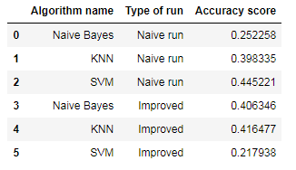

# Document Classification

This project is part of assignment home work I got in course I am taking in university.  
The course called: Practical Web Mining and Modeling for Business Applications.

In this assignment we got as input many documents (average of 200 words in document) and the **goal**  is to predict it subject.

The dataset we worked with is "ohsumed-first-20000-docs" which can be downloaded from here: [Link](http://disi.unitn.it/moschitti/corpora.htm)  
  
#### Sized of datasets:
Train dataset: 10,433 documents  
Test dataset: 12,733 documents  
We have 23 possible classifications for the documents. The sujects are related to medicine and health.  

I solved this assignment in Python (version 2.7.10)  

#### __Work Proccess:__
__Text pre-processing and exploration:__  
1. Read the data from files  
2. Clean the data  
3. Data exploration  
  
#### __Text pre-processing and exploration:__  
4. Feature extraction  
5. Classify using machine learning methods  
6. Tune the models and try to improve results  
7. Choose the best model  
  
The python labraries I mainly used are: Scikit-Learn, nltk, Pandas.
  
The data was read using Scikit-Learn.load_files  
Data cleaning:
   1. Change all text to lowercase
   2. Tokenize the sentences to words (using nltk.tokenize)
   3. Remove stop-words (using nltk.corpus - stop words)
   4. Stemming the words using Porter Stemmer (nltk.stem - PorterStemmer)
  
Data exploration:  
I printed the top 10 common words from each category and saw what are the most common words.  
The common words was added to the stop words list and I run one more time stpo words removal.  
  
Text pre-processing and exploration:  
Feature extraction was done by TfidfVectorizer (using sklearn.feature_extraction.text - TfidfVectorizer).  
We used TfidfVectorizer as: 1. bag of words 2. bi-gram  
  
For classification we used: Naive Bayes, KNn and SVM.  
The algorithm which gave us the best accuracy was SVM with accuract of 44.5%.  
We tried to imrpove our accuracy level and used GridSearchCV and entered parameters to improve.  
We didn't have any luck in improving this as you can see in the jupyter notebook.  
  
Summary:  

